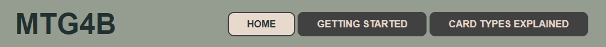
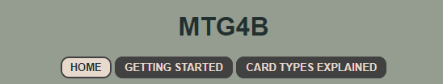
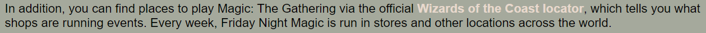
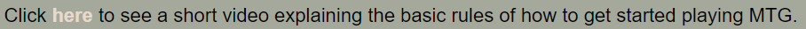
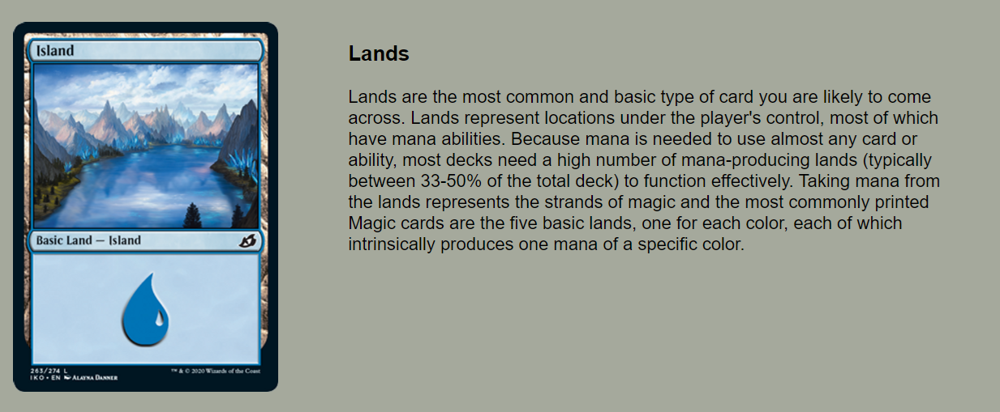
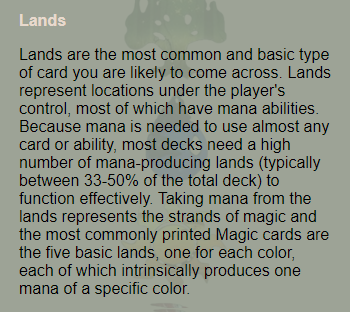

# Magic: the Gathering for Beginners

## Code Institute - First Milestone Project: User Centric Frontend Development.

## Table of Contents

+ [Live Demo](#demo)
+ [UX](#ux)
+ [Mission Statement](#mission-statement)
  + [Strategy](#strategy)
+ [Scope](#scope)
  + [Structure](#structure)
  + [Skeleton](#skeleton)
  + [Surface](#surface)
+ [Technologies](#technologies)
+ [Features](#features)
+ [Deployment](#deployment)
+ [Validator Testing](#validator-testing)
+ [Bugs Fixes and Changes](#bug-fixes-and-changes)

## Demo
A live demo to the website can be found [here](https://arcandrus.github.io/code-institute-milestone-1/)

## UX
This website is designed for beginners interested in learning the basics of the card game Magic: the Gathering (MTG). The use experience is geared towards explaining how to get started playing MTG.

## Mission Statement
My goal is to create a simple, easy to follow explanation of the cards types and how to play MTG. The points I considered with the user in mind are as follows:

+ As a user, I want to understand the purpose of this website quickly and easily.
+ As a user, I want to easily navigate this website (by using a mouse, a keyboard, or a touch screen).
+ As a user, I want to be able to gain a foundation of knowledge to play MTG.
+ As a user, I want to be able to find more information about where and how I can play.
+ As a user, I want access to further information if I should choose to.

## Strategy
The goal is to make a well-functioning, fun website that is engaging for the user. The focus was on making the design both user-friendly and creative.

## Scope
For the users (people interested in the basics of MTG), I wanted to give them a good overview of the basic rules and structure of MTG and how to get started playing. This way, the user can leave the website after exploring the content having a solid understanding of how to start playing MTG and what the cards mean and do within the game.

## Structure
I felt that there were three key areas I wanted to focus on. They are a little history and explanation of the game, a summary of the rules of the game and an explanation of the various card types in the game. As such, the structure fell rather naturally into three pages.

**Home**: An introduction to the MTG universe.

**Getting Started**: A brief explanation of the basics of the game, including a video link with a tutorial video.

**Card Types Explained**: An overview of the different types of cards players can expect to see in the game.

## Skeleton
I wanted to have a consistent appearance across all pages for ease of use. As such, the three pages follow a very similar template, which I find to be easy to follow and understand.

A Wireframe for the website was designed using Balsamiq and was arranged in such a fashion as to keep a consistent feeling and design across all pages.

The Wireframe design can be found [here](./readme-assets/mtg-wireframe.pdf) (pdf format).

## Surface
Originally I had chosen a dark background image that features the 5 color types in MTG and used a contrasting background color for my containers to keep the clear and readable but ultimately I decided to change the background image as I felt the previous image was a little too busy and could lead to a sensory disparity for the user. As such, I overhauled my chosen colour palette to something softer and I believe it will provide a better user experience. The background image still features each of the 5 Magic: the Gathering colour symbols, but in a much less busy way.

I have used softer earthy tones throughout the website. I feel these colours are calm and not intrusive to the user experience while being consistent and easy to contrast and navigate and to that end, I have also added a background colour to the nav elements to ensure a clear contrast. I have also set the default font size to 22px as I feel this too will allow for an easier to read experience for the user.

## Technologies
**HTML** - To create a basic site skeleton and add the content.

**CSS** - To create a bold but usable front-end and to give a great user experience

**Balsamiq** - To create a wireframe

# Features
## Consistent Features

### Navbar and Header

Clear and readable title and Navigation bar. The Navbar is enclosed within the header which is fixed to the top of each page ensuring constant access to all pages of the website.
On smaller screens, the Navbar changes from flowing left to right to stacking vertically to ensure accessibility on all devices and the title and body text is resized to ensure readability.

The MTG logo is displayed in a fixed position above the main body of each page. This was implemented to give the user a point of reference to outside sources and products bearing the same logo image.

## Page Features

### Home
There is a brief introduction and explanation of the websites goal and history of MTG.
There is a link to the Wizards of the Coast Locator service, which can help new players find places to play MTG.

### Getting Started
This page features a link to a target="_blank" page that will display a video tutorial from the MTG YouTube channel. I used Controls and Autoplay to make the user experience more fluid.
There is also a link under the video to the MTG YouTube channel proper if the user is looking for further information not covered in the video.

### Card Types Explained
Using a customized table layout, this page features a display of written explanation and pictures to show each card type and give a summary of how the card works in the game.

On smaller screens, the picture is replaced with a link to each picture. This was implemented to allow the page to retain readability while still allowing access to a picture example.

## Deployment
The site has been deployed using [GitPages](https://pages.github.com) in the following way.
+ In the Github repository, the Setting tab.
+ Under General, navigate to Code and Automation and select 'Pages'.
+ In the Build and Deployment section for Source, select 'Deploy from a branch' from the drop-down list.
+ For Branch, select 'main' from the drop-down list and Save.
+ On the top of the page, the link to the complete website is provided.
+ The deployed site will update automatically upon new commits to the master branch.

## Validator Testing
**HTML** No errors when tested using [W3C Validator](./readme-assets/html-pass.png)

**CSS** No errors when tested using [Jigsaw Validator](./readme-assets/css-pass.png)

**Accessibility** Confirmation that my site passed accessibility when tested using [Lighthouse DevTools](./readme-assets/lighthouse-pass.png)

I have also asked several users to explore the website on different devices including iPhone 14, iPad, Oppo mobile devices, Sony mobile devices and several different PC and Laptop setups to ensure consitency and usability across multiple platforms.  

## Bug Fixes and Changes

+ Commit 1 : updated background image URL
+ Commit 2 : fixed broken link on index
+ Commit 3 : resized logo image
+ Commit 4 : uploaded video
+ Commit 5 : added aria labels to the nav content
+ Commit 6 : reformatted code to minimise empty space
+ Commit 7 : added meta data in the description, keywords and author sections
+ Commit 8 : added comment labels to HTML and CSS to explain structure
+ Commit 9 : changed file structure to standard practice
+ Commit 10 : added readme-assets and wireframe.pdf
+ Commit 11 : added color palette and header images and corrected some spelling
+ Commit 12 : changes to styling and background image
